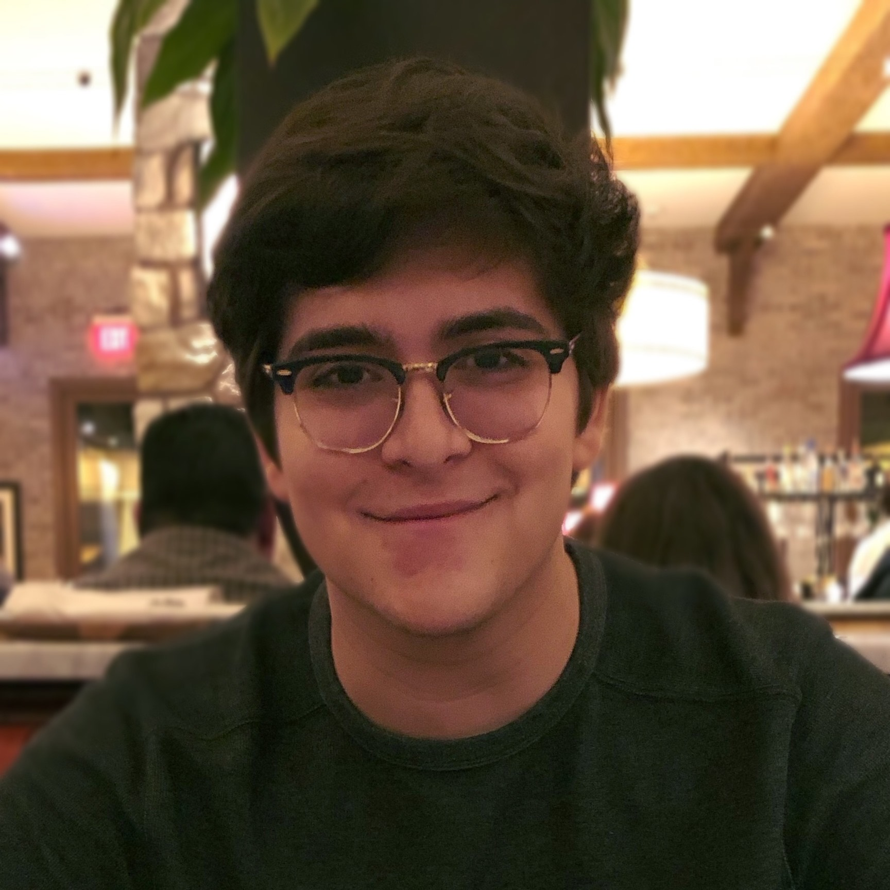

## About Me

Hello! I am a second-year student pursuing a *[B.S. in Computer Science]* and a *[B.S. in Mathematics-Probability and Statistics]* at {TBD}.

## Research Interests

I am interested in the intersection of Machine Learning and Deep Learning for Healthcare Applications.
Currently, I am conducting research on Epileptic Seizures with applications to Logistic Regression and Machine Learning 
through Google & the University of California, San Diego's ExploreCSR [Explore Computer Science] Research Program.

This Summer, I will be an undergraduate research intern at the Mesirov Lab [University of California, San Diego: School of Medicine].
Here, I plan to conduct algorithmic research on Cancer Genomics.

## Computer Science Experiences

[1] Computer Science and Engineering Department // UCSD CSE

**Undergraduate Computer Science Researcher, Google ExploreCSR** January 2020 - Present

● Develop Machine Learning solutions for Epileptic Seizure Detection through Logistic
Regression & Neural Networks

● Present a professional poster-board at a CSE Research Symposium with detailed research
findings

● Develop strong relationships with CSE professionals from Google and a Ph.D. Mentor

---

[2] Computer Science/Information Systems Lab // Grossmont College

**Computer Science Tutor** August 2019 - Present

● Assist students in the Grossmont CSIS Lab through my knowledge of programming

● Develop Computer Science and Engineering projects with students

● Current knowledge consists of Java, C++, and Python

---

[3] Computer Science Organization // Grossmont College

**President** August 2018 - December 2019

● Delivered workshops to 70+ members in topics such as ML / AI, Data Science, and iOS + Web
Development.

● Work with Executive Board to arrange professional, technical, and networking opportunities
for members

---

[4] theCoderSchool North San Diego 

**Code Coach** April 2019 - May 2019

● Teach and Mentor Children (Age 7-13) how to Code utilizing Scratch and Python programming
languages

---

## Projects

[1] **Chess AI Game** 

● Implemented in C++

● Utilized Minimax algorithm for Opponent AI

● 3 difficulty levels

● {*Github Link*}

---

[2] **Battleship Game**

● Implemented in C++

● 2-Player Battleship Game for Console Window 

● {*Github Link*}

## Awards

Award Title                                   | Description                                           |
----------------------------------------------|-------------------------------------------------------|
5th in Nation - Database Design & Applications| FBLA National Leadership Conference (2018)            |
8th in Nation - Computer Applications         | FBLA National Leadership Conference (2017)            |
1st in State - Database Design & Applications | CA FBLA State Leadership Conference (2018)            |
1st in State - Spreadsheet Applications       | CA FBLA State Leadership Conference (2018)            |
Qualcomm Diversity Scholarship                | UCSD Society of Hispanic Professional Engineers (2018)|

**KEY:**

**FBLA** = **F**uture **B**usiness **L**eaders of **A**merica

**UCSD** = **U**niversity of **C**alifornia, **S**an **D**iego

## Skills

Programming Skills   | Software Tools    | Certificates
---------------------|-------------------|---------------------------------------------------------------------------------
Python               | ROS               | Intermediate Python for Data Science [DataCamp]
C++                  | Linux             | Python Data Science Toolbox [DataCamp]
C                    | Jupyter Notebooks | Programming Foundations: Object-Oriented Design & Algorithms [LinkedIn Learning]
Java                 | VS Code           |
SQL                  | XCode             |
x86-64 Assembly      | IntelliJ IDEA     |

---